# Project Title : Rode Clone

## About 

This was my third tailwind project to build Rode clone.

## What Did I Learn From This project

I got deep knowledge on Tailwind and building projects.

## Time Taken To Finish The Project

Around 10 Hours.

## Screen Resolution

1920 * 750

#

## Project Final Look

#

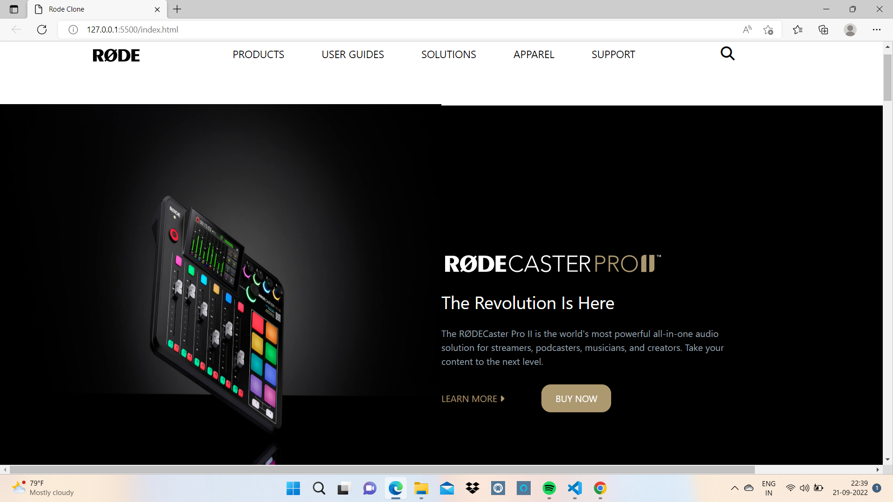

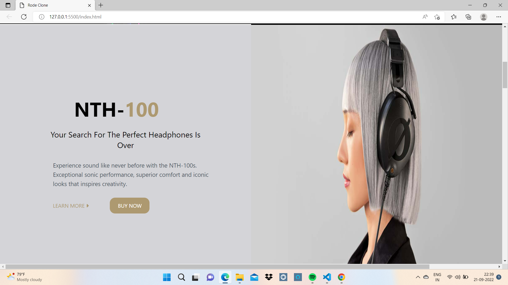

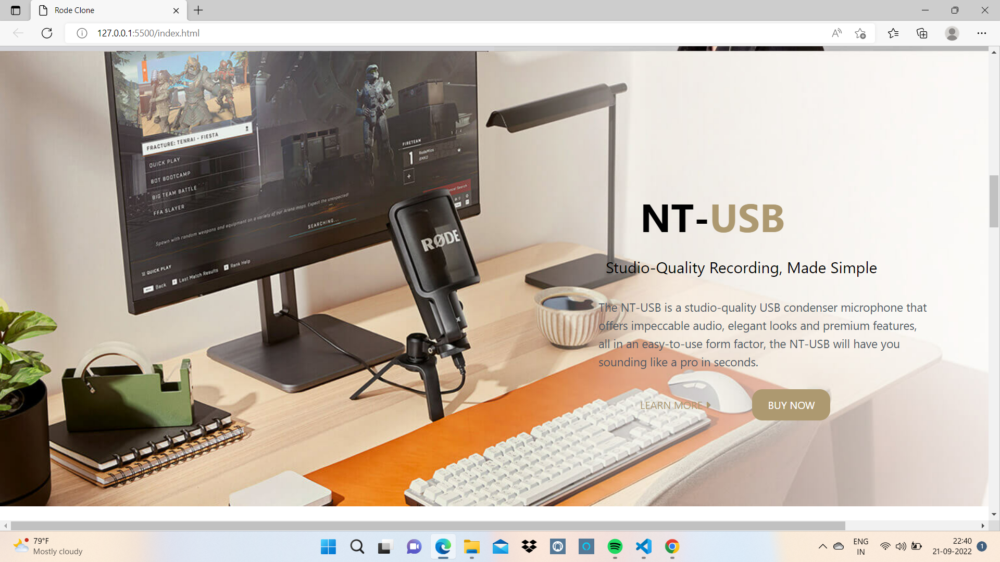

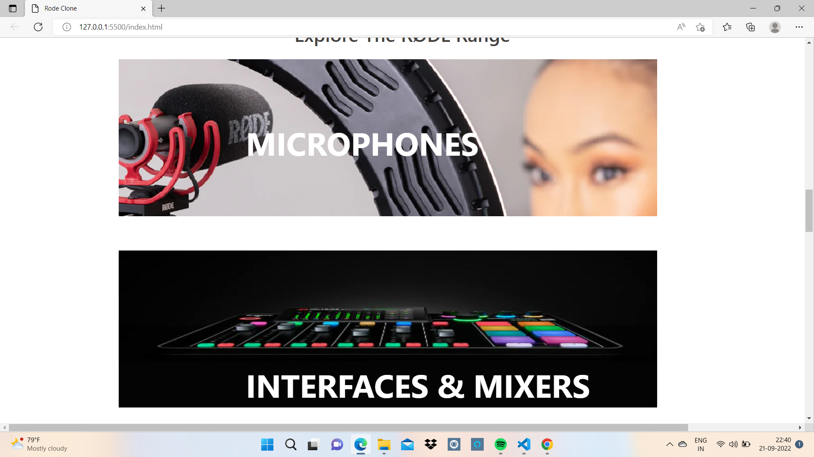

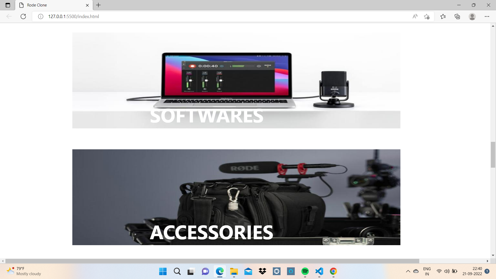

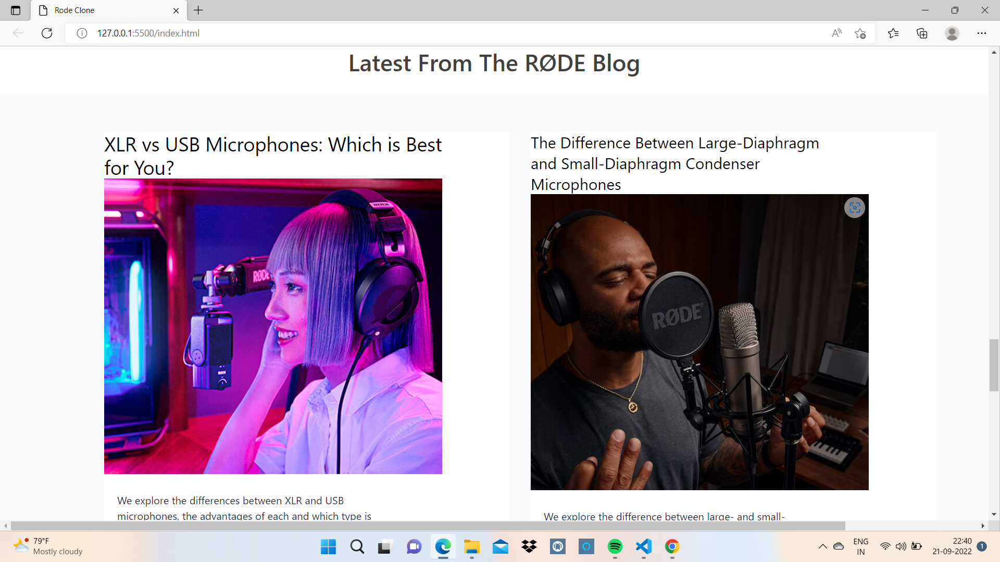

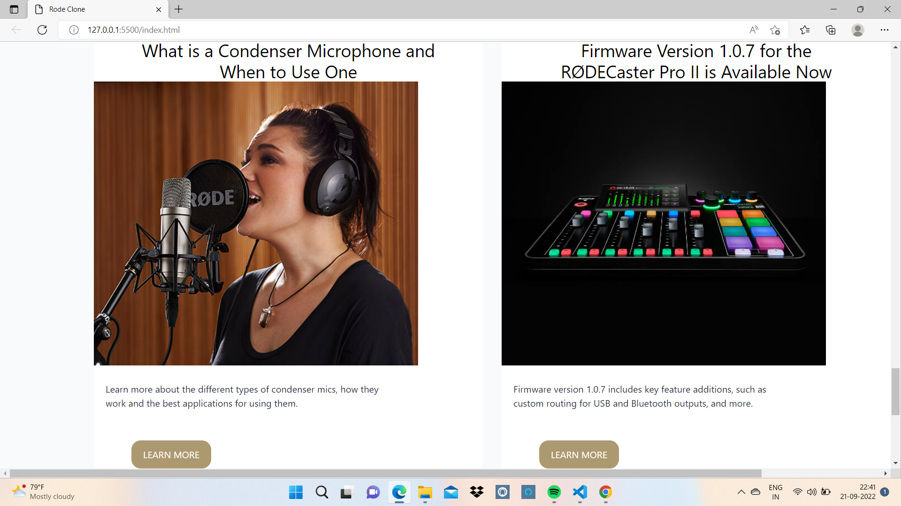

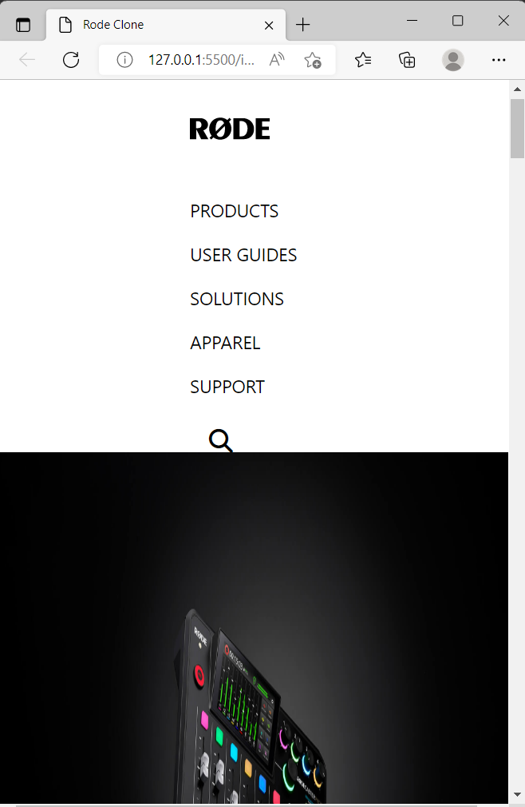

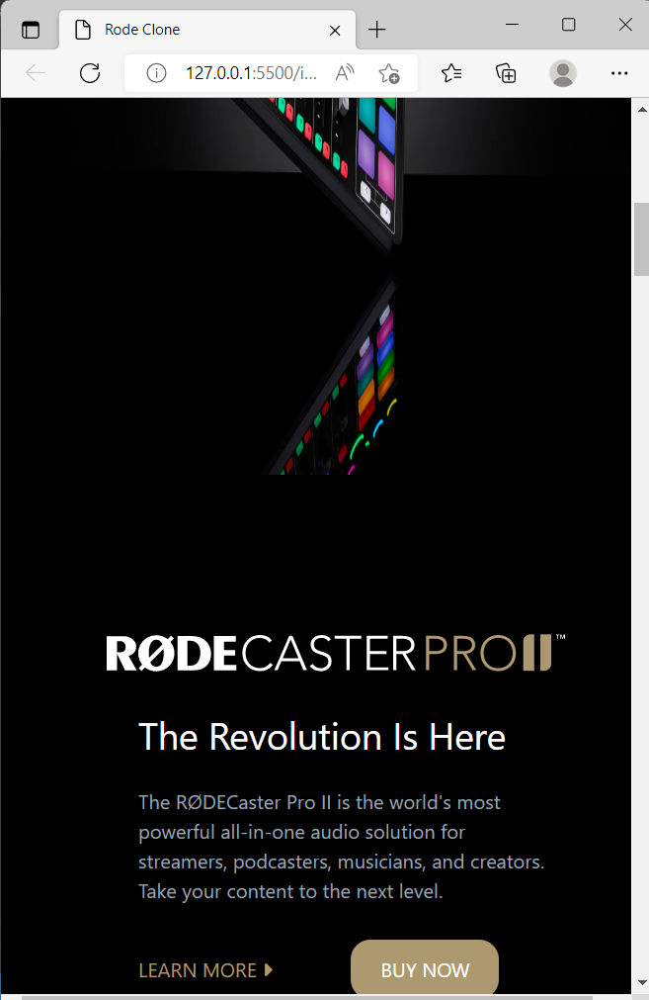

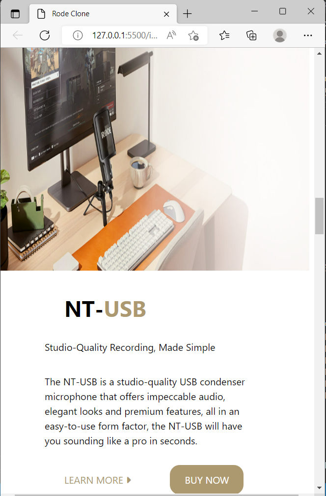

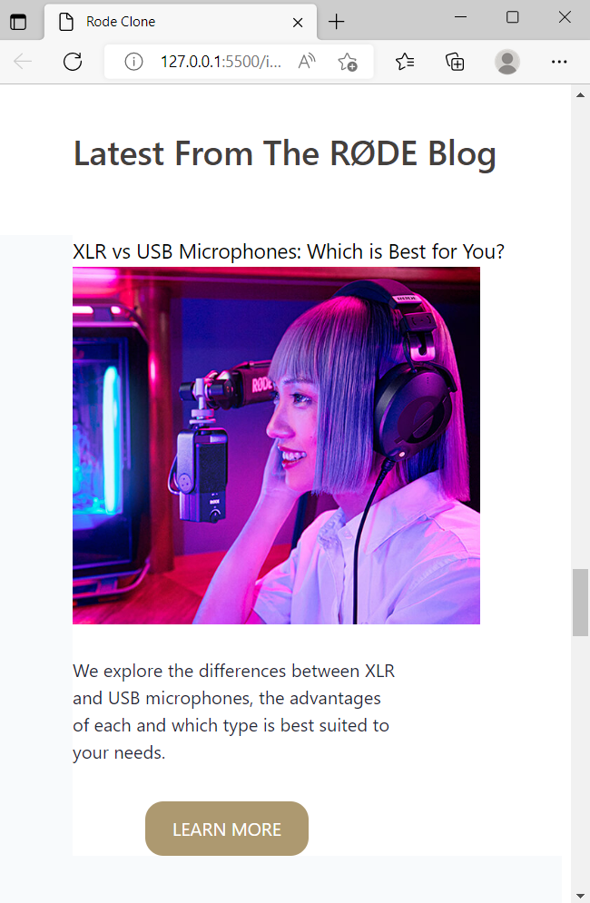

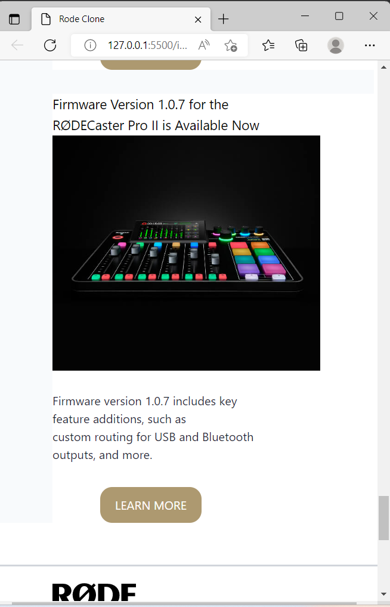

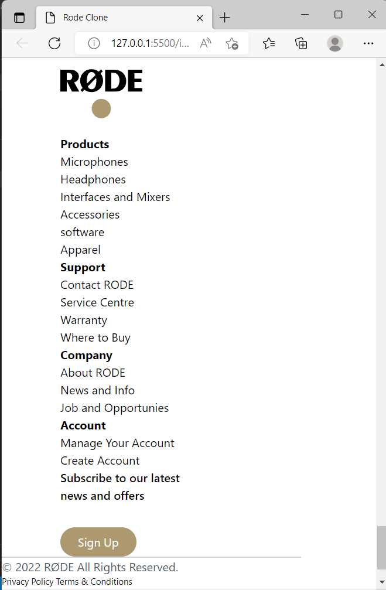

